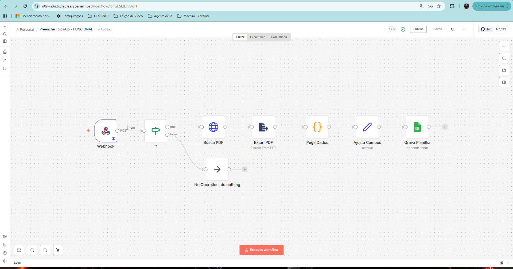
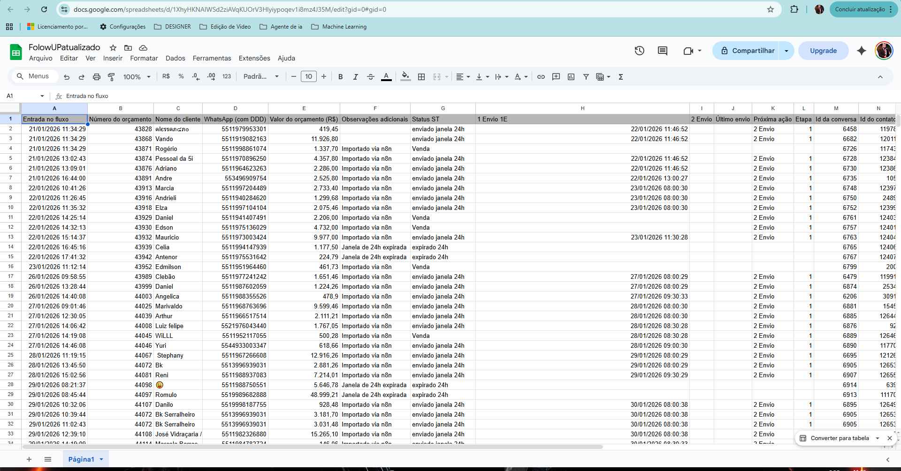
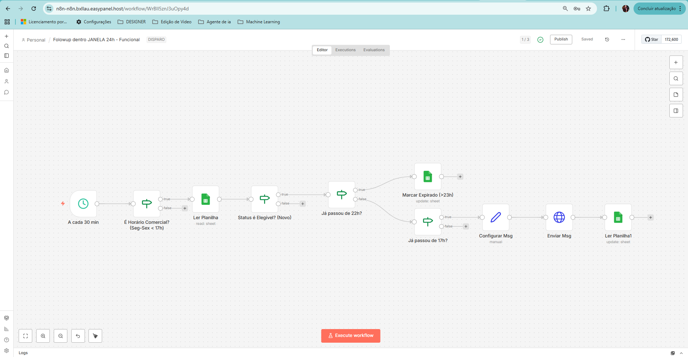
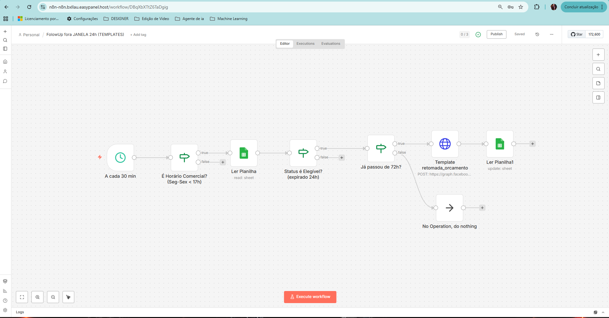

# 🔗 Automação WhatsApp com n8n, Chatwoot e Evolution API

Projeto **real em produção** de **implementação, integração e operação** de uma stack completa para automação de atendimento e follow-up de orçamentos via WhatsApp.

Este projeto **não cria ferramentas do zero** — ele **integra sistemas consolidados**, aplica **regras de negócio reais** e entrega **automação funcional em ambiente produtivo**.

> 🔧 **Papel no projeto**: arquitetura, implementação, integração e operação da stack completa.

---

## 🧠 Problema de Negócio Resolvido

Antes da automação:

- Atendimento manual e desorganizado via WhatsApp  
- Falta total de controle de follow-up de orçamentos  
- Perda de vendas por esquecimento ou atraso no contato  
- Campanhas sem rastreabilidade  
- Dados espalhados e sem governança  
- Dependência excessiva de ação humana  

---

## ⚙️ Solução Implementada

Foi implementada uma **stack integrada**, onde cada sistema cumpre um papel claro, operando como **um único fluxo automatizado**:

- Orquestração de fluxos com **n8n**
- Gestão de conversas e CRM com **Chatwoot**
- Integração oficial com WhatsApp via **Evolution API**
- Controle operacional e rastreabilidade via **Google Sheets**
- Persistência de dados em **PostgreSQL**
- Cache, estado e controle de execução com **Redis**

📌 **O valor do projeto está na integração inteligente entre sistemas, regras de negócio e automações.**

---

## 🧱 Arquitetura Técnica

- VPS Ubuntu 24.04 (Hostinger)
- Docker + EasyPanel
- n8n — automação e regras de negócio
- Chatwoot — CRM e atendimento humano
- Evolution API — WhatsApp
- PostgreSQL — persistência de dados
- Redis — controle de estado e cache

### 🧱 Infraestrutura em produção (EasyPanel)

---

## 🔄 Fluxos Implementados

- Envio automático de campanhas respeitando horário comercial  
- Controle de mensagens já enviadas (anti-duplicidade)  
- Follow-up automático de orçamentos  
- Respeito total à janela de 24h da Meta  
- Uso de template oficial fora da janela  
- Atualização automática de status em planilhas  
- Delay inteligente entre mensagens  
- Fallback automático para atendimento humano  

📌 Todos os fluxos foram **modelados, configurados e testados em produção**.

---

## 🤖 Automação de Follow-up de Orçamentos (Destaque)

Fluxo responsável por **recuperação ativa de vendas**, respeitando regras da Meta.

---

### 📄 1. Detecção automática de envio de orçamento (PDF)

Sempre que um orçamento em PDF é enviado via Chatwoot, o sistema identifica automaticamente e inicia o fluxo de controle.

---

### 📊 2. Registro e controle em planilha

Planilha central com controle de:

- status do orçamento  
- horário do envio  
- janela da Meta  
- novos contatos  

---

### ⏱️ 3. Follow-up automático após 20h (dentro da janela)

Envio automático de mensagem **dentro da janela de 24h**, sem uso de template oficial.

---

### ⏳ 4. Follow-up após 72h (fora da janela da Meta)

Disparo automático de **template oficial aprovado pela Meta**, conforme regras da plataforma.

---

### ❌ 5. Interrupção automática em caso de venda

Caso o orçamento seja convertido em venda, o fluxo é encerrado automaticamente, evitando contatos indevidos.

---

### 🧠 Workflow completo no n8n

Fluxo responsável por:

- validar horário comercial  
- controlar elegibilidade  
- decidir tempo (20h / 72h)  
- aplicar regras da Meta  
- executar fallback  

📁 Documentação detalhada do fluxo:  
➡️ `flows/FollowUp_Automatico.md`

---

## 📊 Atendimento Humano Integrado (Chatwoot)

A automação organiza o processo, mas mantém o **humano no controle**.

---

## 📡 Integração WhatsApp (Evolution API)

Gerenciamento das instâncias WhatsApp conectadas à automação.

---

## 🚀 Próximos Passos

- Classificação de leads com IA  
- Embeddings para histórico de conversas  
- Dashboard analítico de conversão  
- Score automático de follow-up  

---

## 🧠 Conclusão

Este projeto demonstra capacidade real de:

- Arquitetar soluções funcionais  
- Integrar múltiplos sistemas  
- Aplicar regras complexas de negócio  
- Operar automações em produção  
- Pensar como **engenheiro de automação**, não apenas como usuário de ferramenta  

---

## 💬 Frase final

> **“Não criei as ferramentas — criei o sistema funcionando.”**
