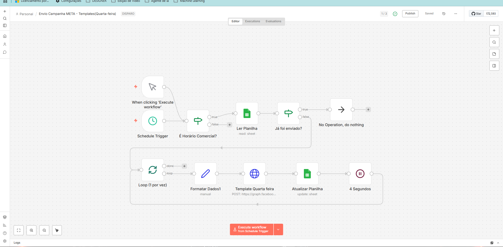
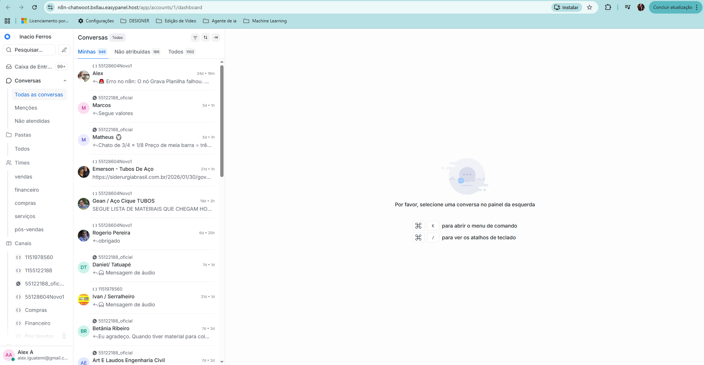
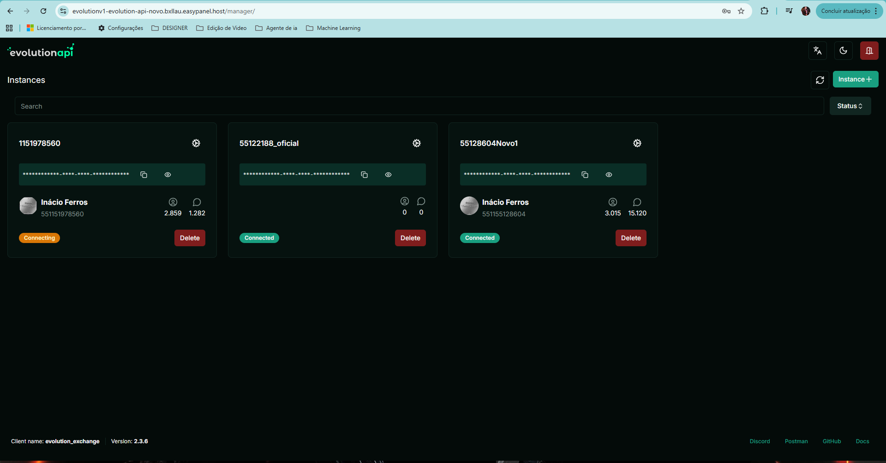
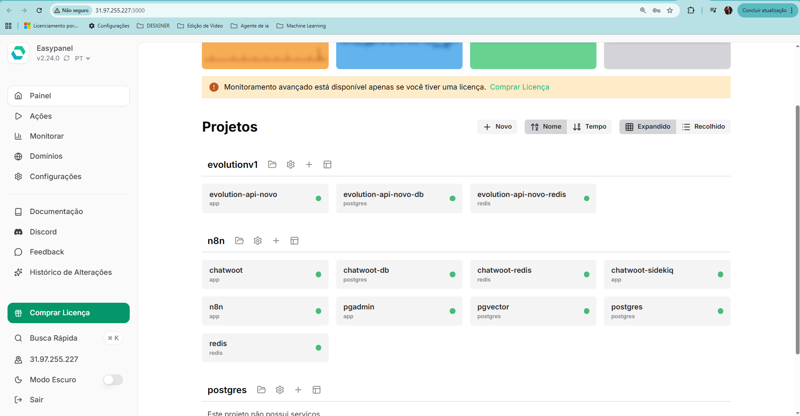

# 🔗 Automação WhatsApp com n8n, Chatwoot e Evolution API

Projeto real de automação para atendimento e campanhas via WhatsApp, utilizando n8n, Chatwoot, Evolution API e infraestrutura em VPS.

## 🧠 Problema resolvido
- Atendimento manual e desorganizado via WhatsApp
- Falta de controle de follow-up
- Campanhas sem rastreabilidade
- Dados espalhados em planilhas

## ⚙️ Solução
Criação de uma stack completa com:
- Automação de mensagens via n8n
- CRM com Chatwoot
- Integração WhatsApp via Evolution API
- Controle de campanhas via Google Sheets
- Banco de dados PostgreSQL
- Cache e controle com Redis

## 🧱 Arquitetura
- VPS Ubuntu 24.04 (Hostinger)
- Docker + EasyPanel
- n8n (automação)
- Chatwoot (CRM)
- Evolution API (WhatsApp)
- PostgreSQL + Redis

## 🔄 Fluxos implementados
- Envio automático de campanhas por horário comercial
- Controle de mensagens já enviadas
- Follow-up automático
- Atualização de status em planilhas
- Delay inteligente entre mensagens
- Fallback para humano

## 📸 Evidências
## 📸 Evidências do sistema em produção

### 🔄 Workflow de automação no n8n
Fluxo responsável por validar horário comercial, controlar envios, evitar duplicidade e realizar follow-up automático.

---

### 📊 Dashboard de atendimento no Chatwoot
Painel utilizado para acompanhamento das conversas, distribuição para atendimento humano e histórico de mensagens.

---

### 📡 Instâncias WhatsApp na Evolution API
Gerenciamento das conexões WhatsApp utilizadas pela automação, com controle de status e sessões ativas.

---

### 🧱 Infraestrutura em VPS (EasyPanel)
Ambiente Docker rodando em VPS Ubuntu 24.04, com serviços isolados e monitoramento básico.

## 🚀 Próximos passos
- IA para classificação de leads
- Embeddings para histórico de conversa
- Dashboard analítico
