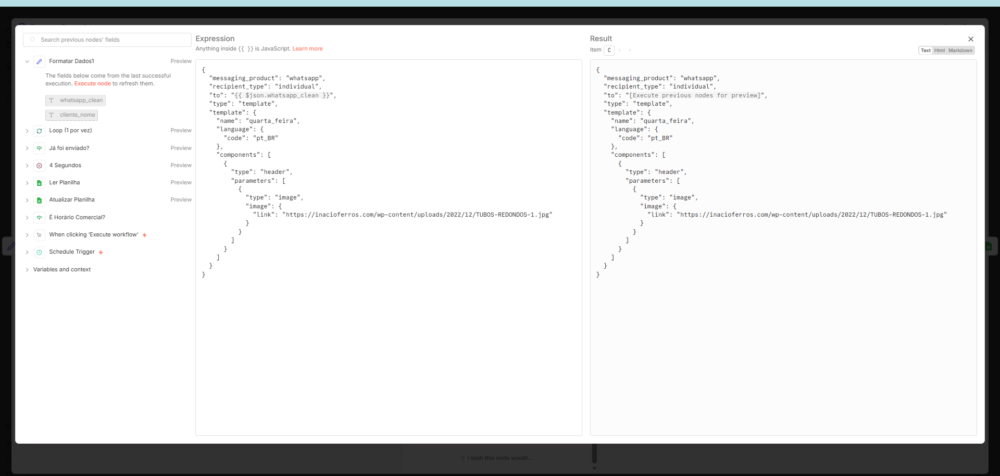

# 📣 Fluxo: Envio de Campanha META – Quarta-feira

## 🎯 Objetivo do fluxo
Automatizar o envio de campanhas via WhatsApp utilizando templates da Meta, garantindo que os disparos ocorram apenas em horário comercial, sem reenvios duplicados e com controle total via planilha.

---

## ⏱️ Gatilho
- **Schedule Trigger**: execução automática em dias e horários definidos
- **Execução manual**: utilizada para testes e validações do fluxo

---

## 🧠 Lógica do fluxo (passo a passo)
1. Verifica se o horário atual está dentro do horário comercial
2. Lê a planilha de controle de campanhas no Google Sheets
3. Verifica se o contato já recebeu a mensagem
4. Formata os dados necessários para o envio do template
5. Envia o template via Evolution API (WhatsApp)
6. Atualiza o status do envio na planilha
7. Aplica delay entre mensagens para evitar bloqueios
8. Ignora contatos já processados

---

## 🔧 Tecnologias utilizadas
- **n8n** – Orquestração da autom

## 🖼️ Diagrama do fluxo no n8n

A imagem abaixo representa o fluxo real configurado no n8n para o envio de campanhas de WhatsApp utilizando templates da Meta.

