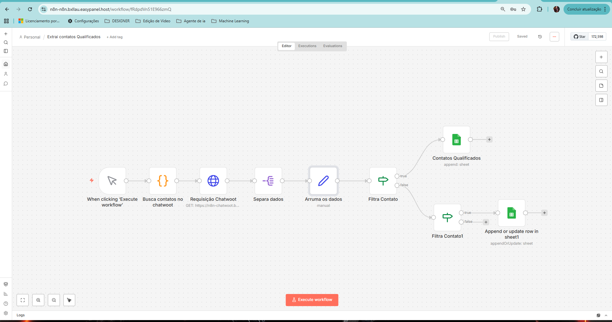

# 📤 Fluxo: Extração de Contatos Qualificados (Chatwoot)

## 🎯 Objetivo do fluxo
Este fluxo é responsável por extrair contatos qualificados a partir do Chatwoot, normalizar os dados e disponibilizá-los para uso em campanhas de WhatsApp e análises posteriores.

---

## ⏱️ Gatilho
- Execução manual (on-demand)
- Pode ser adaptado para execução agendada (schedule)

---

## 🧠 Lógica do fluxo (passo a passo)
1. Conecta na API do Chatwoot
2. Realiza paginação para grandes volumes de contatos
3. Filtra contatos válidos (qualificados)
4. Normaliza campos relevantes (nome, telefone, status)
5. Prepara os dados para exportação
6. Disponibiliza os contatos para uso em campanhas

---

## 🔧 Tecnologias utilizadas
- **n8n** – Orquestração do fluxo
- **Chatwoot API** – Fonte dos contatos
- **JavaScript (Function / Set nodes)** – Tratamento e normalização
- **Google Sheets (opcional)** – Persistência dos dados

---

## 🛡️ Regras e cuidados
- Paginação para evitar limites de API
- Tratamento de erros em chamadas HTTP
- Tokens e IDs sensíveis não versionados no repositório
- Arquivo JSON disponibilizado apenas como `.example`

---

## 🖼️ Diagrama do fluxo no n8n

A imagem abaixo representa o fluxo real configurado no n8n para extração e qualificação de contatos a partir do Chatwoot.

---

## 📌 Observações finais
Este fluxo é utilizado como base para campanhas segmentadas e automações posteriores, garantindo que apenas contatos válidos sejam processados.

